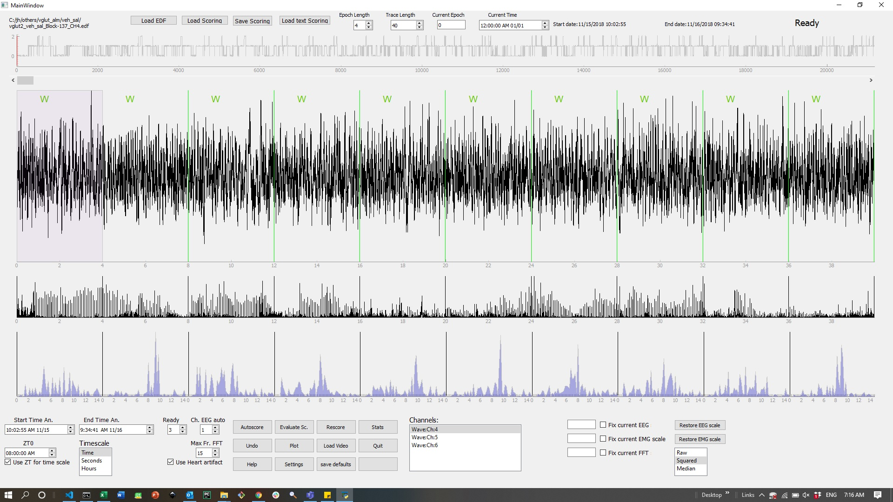

# iScore (under construction)
Rodent sleep scoring program

Current version has only manual scoring and scoring export/import enabled.
Score can be a python file (pkl), a matlab file form Matlab's iscore (.mat) or a text file with the epoch state in each line (.txt).

Scorings are saved as a pkl file and txt file, that can be loaded into Matlab's iScore.

## Autoscore feature: Just load the edf file and press autoscore button. Current version requires no user input, but all states must be present with a minimum prevalence. NR and W should be at least 20% of the epochs while REM should be at least 4% of the epochs and WA 2%. A future version will ask for user input to eliminate this restriction. After autoscoring, press r to go to the next rem epoch and check for bout fragmentation.

# Installation
Download the files in this repo to a folder

Download and instal Python 3.8 or 3.9 (google it if you don't know how)

Open terminal and type:

python -m pip install --upgrade pip

pip install -r requirements2.txt

**Note:** On Mac/Linux type python3 and pip3 instead of python and pip. If there are errors, try requirements.txt instead.

# Execution

Open a terminal, go to the repo folder and type:

PC: python escore.py
  
Mac/Linux: python3 escore.py
